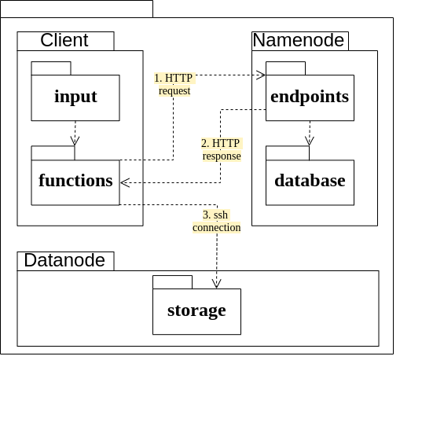
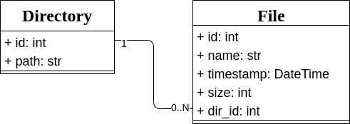

# DFS

## Team
* Danis Begishev [@beg1shev](https://github.com/beg1shev)
* Aydar Gabdrahmanov [@gabdir](https://github.com/gabdir/)
* Ruslan Sabirov [@russab0](https://github.com/russab0/)

## Architecture

## Running
TODO

## Usage
On client:
* `init` Initialize the client storage on a new system (removes any existing file in the dfs root directory and return available size).
* `create filename`:​ Creates a new empty file.
* `read filename`: Read any file from DFS (download a file from the DFS to the Client side).
* `write​ filename`: Put any file to DFS (upload a file from the Client side to the DFS)
* `delete filename`: Delete any file from DFS
* `info filename`: Provide information about the file (any useful information - size, node id, etc.)
* `copy filename newlocation`: Create a copy of file.
* `mode filename newlocation`: Move a file to the specified path.
* `diropen dirname`: Change directory
* `dirread dirname`: Return list of files, which are stored in the directory.
* `dirmake dirname`: Create a new directory.
* `dirdel dirname`: Delete directory. If the directory contains files the system ask for confirmation from the user before deletion.